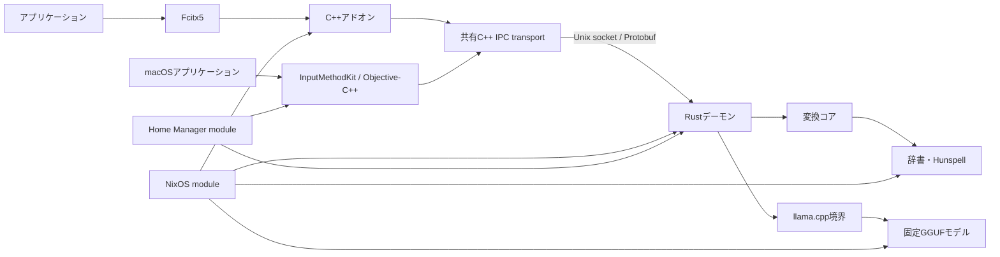

# アーキテクチャ

この文書は、現在のbeanKeyを構成するコンポーネントと、その依存境界を説明します。初期実装の計画や完了条件ではなく、実装を変更するときに維持すべき構造を対象にします。

Fcitx5とmacOSは対等なOSアダプタです。操作と使用感を共有し、互換性を改善するために両方を変更できます。macOSフロントエンドはInputMethodKit、Objective-C++、候補パネルを所有し、変換・学習・状態遷移は共通daemonが所有します。

## 全体構成

Fcitx5プロセスへロードするのはC++アドオンだけです。macOSではInputMethodKitのInput Methodが別プロセスで動作します。どちらも辞書変換、学習、Zenzai推論は共通のRustデーモンで実行し、変換やllama.cppの障害をフロントエンドから分離します。

## コンポーネント

| 場所 | 責任 |
| --- | --- |
| `crates/converter` | 入力状態、辞書読み込み、ラティス探索、候補生成、学習、Zenzai用promptとprefix制約付き再探索 |
| `crates/llama` | llama.cpp C APIのbinding、モデル読み込み、tokenize、decode、logit取得 |
| `crates/daemon` | 設定、Unix socket、Protobuf、入力セッション、converterとllamaの接続 |
| `fcitx5` | Fcitx5 key eventの正規化、プリエディット、候補UI、確定、デーモン起動 |
| `macos` | InputMethodKit、キー正規化、UTF-16変換、marked text、候補パネル、確定、デーモン起動 |
| `ipc/cpp` | 両フロントエンドの共有Unix socket transportと生成Protobuf型 |
| `proto/beankey.proto` | RustとC++の通信契約 |
| `nix` | package、固定資産、NixOS/Home Manager module、共有optionと内部設定の生成 |

## 依存境界

`crates/converter`は変換ロジックの所有者です。Fcitx5、Protobuf、ソケット、llama.cpp C API、NixOS設定には依存しません。

`crates/llama`はllama.cpp固有の型、pointer、`unsafe`処理を内部へ閉じ込めます。変換アルゴリズムとIPCは持ちません。

`crates/daemon`はconverterとllamaを組み合わせるアプリケーション境界です。辞書探索や候補順位付けを独自に実装しません。

Fcitx5とmacOSのフロントエンドは、Rust crateへ直接linkしません。候補の生成や並べ替えも行わず、デーモンの応答をOS側の入力APIへ反映します。共有transportはキー操作、入力状態、候補UIを知りません。

## 入力処理

1. フロントエンドがkey eventを、入力、削除、移動、変換、確定などの意味的な操作へ変換します。
2. フロントエンドが入力コンテキストに対応するsession IDとともに、要求をデーモンへ送ります。
3. デーモンがsessionの入力状態を更新し、converterへ変換を要求します。
4. Zenzai評価が必要な場合は、デーモンがconverterのdraft候補とllamaの評価を接続します。
5. デーモンがプリエディット、候補、予測、確定文字列、キーを処理したかどうかを返します。
6. フロントエンドは応答をFcitx5の標準UIとcommit API、またはInputMethodKitのmarked text・insertTextと非アクティブ候補パネルへ反映します。

同じsessionの要求は順番に処理します。異なるsessionの辞書処理は独立していますが、共有するllama.cpp contextへの推論は直列化します。

## Zenzai

Zenzaiは最終候補を一度だけ並べ替える処理ではありません。

1. converterが辞書ラティスからdraft候補を生成します。
2. 候補と周辺文脈からpromptを構築します。
3. llama.cppが候補tokenを評価します。
4. モデルが別のtokenを選んだ場合、その位置までのUTF-8 prefixを取得します。
5. converterがprefixを制約として辞書ラティスを再探索します。
6. 候補が通過するか、全文が確定するか、推論回数の上限に達するまで繰り返します。

converterはpromptと再探索、llama crateはモデル操作、デーモンは両者の進行を所有します。

## IPCとプロセス

フロントエンドとデーモンは、明示したruntime root内の`beankey/daemon.sock`で通信します。Linuxのrootは`$XDG_RUNTIME_DIR`、macOSは`~/Library/Caches/beanKey/runtime`です。wire formatはvarint length-delimited Protobufで、1 messageの上限は1 MiBです。

各envelopeはprotocol version、request ID、session ID、payloadを持ちます。Fcitx5固有のkey symbolはwireへ流さず、意味的な操作だけを送ります。

フロントエンドがsocketへ接続できない場合は、Nix store pathへ固定された`beankey-daemon`を直接起動して再接続します。systemd service、socket activation、LaunchAgentは使用しません。最後のclientが切断し、sessionがなくなるとデーモンも終了します。

runtime directoryはmode `0700`、socketはmode `0600`です。デーモンはLinuxの`SO_PEERCRED`、macOSの`getpeereid`で接続peerのUIDを検証し、自分と異なるUIDからの接続を拒否します。stale socketはprocess lockを取得した同一UIDのデーモンだけが削除できます。

## 障害時の扱い

フロントエンドからデーモンへの要求には5秒の期限があります。接続、要求、応答に失敗した場合、対応するsession、プリエディット、候補をresetします。

応答を得ていないキーは未処理としてアプリケーションへ返します。フロントエンド内でkey eventをbufferしたり、自動的に再送したりはしません。

macOSでは、接続とdaemon起動の準備をbackgroundで行い、準備前のキーは未処理として返します。接続の世代が変わった後は旧sessionを使いません。準備後の要求とUI更新はmain threadで直列処理します。

## macOSの入力境界

InputMethodKitがクライアントごとに作るcontrollerとdaemon sessionを1対1に対応させます。キー入力、候補の番号・クリック選択、学習忘却、入力訂正は既存の意味的操作へ変換します。候補パネルはフォーカスを奪わず、caretの画面座標と画面端に合わせて配置します。

wire上のUnicode scalar offsetとCocoaのUTF-16 offsetは`macos`内で変換します。周辺文脈は選択位置の前後だけを取得し、編集中のmarked textを除外します。クライアントが範囲を提供しない場合は、文脈を取得できないことをdaemonへ伝えます。

候補の確定は、固定したazooKey Desktopと同様に文字列の挿入だけを行います。Fcitx5でも通常のcommit APIを使い、確定後にカーソル位置を調整する追加アクションは生成・転送しません。

## NixOS統合

公開設定は`programs.beanKey`だけです。NixOS moduleは次のものを導入します。

- Fcitx5アドオン
- Rustデーモン
- 固定辞書と絵文字辞書
- 固定GGUFモデルとtokenizer
- nixpkgsのllama.cpp、Hunspell、英語・ギリシャ語辞書

moduleは`programs.beanKey`から内部TOMLを生成し、`/etc/beankey/config.toml`からNix store上の生成物を参照させます。アドオンは、この設定ファイルを指定してデーモンを起動します。

モデル、辞書、tokenizer、実行ファイルはNix storeへ置きます。学習データなどの可変状態はユーザーのXDG state directoryに置き、Nix管理の不変資産と分離します。

## macOS統合

`nix/settings.nix`がNixOSとHome Managerの共通option、検証条件、内部TOML生成を所有します。macOS packageはdaemonと生成設定のNix store pathをbundleへ埋め込みます。

Home Manager moduleは`beankey-install`をactivationで実行します。installerは署名したbundleの実体を`~/Library/Input Methods/beanKey.app`へ置き、公開TIS APIで登録します。有効化・選択は利用者がシステム設定で行い、既存の入力ソースは変更しません。更新後は起動中の旧プロセスを使わないよう、必要に応じて再ログインします。

単体インストールでもNix storeのdaemonと動的ライブラリがGCで削除されないよう、`~/Library/Application Support/beanKey/package`をpackageへの間接GC rootにします。更新時には同じ参照を新packageへ置き換えます。

学習データは`~/Library/Application Support/beanKey/learning`、daemonの起動ログは`~/Library/Logs/beanKey/daemon.log`に保存します。独自設定GUIは提供しません。

## 配布資産

辞書と絵文字辞書は、`nix/assets.nix`の`fetchFromGitHub`でcommitとhashを固定して取得し、生成済みデータを直接packageします。Git submoduleは使用しません。開発環境とpackageのテストには、同じ辞書packageのNix store pathをテスト専用の`BEANKEY_TEST_DICTIONARY`と`BEANKEY_TEST_EMOJI_DICTIONARY`で渡します。

直接配布する辞書、絵文字データ、tokenizer、GGUFモデルには、資産ごとのlicense本文、取得元、固定revision、attributionをNix packageへ同梱します。

llama.cpp、Hunspell、Hunspell辞書はnixpkgsの通常依存として使用し、beanKeyの配布資産として複製しません。製品のビルドと実行にSwiftは使用しません。
